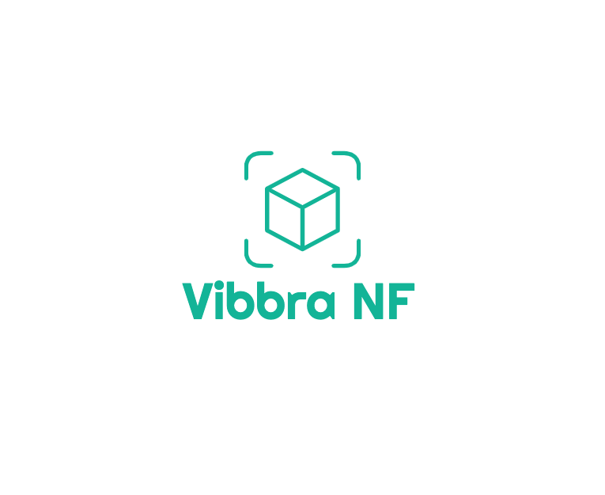
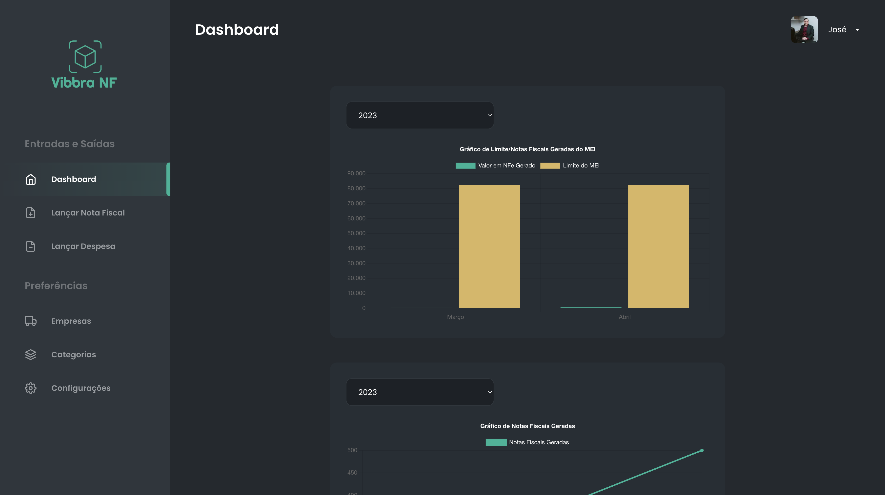
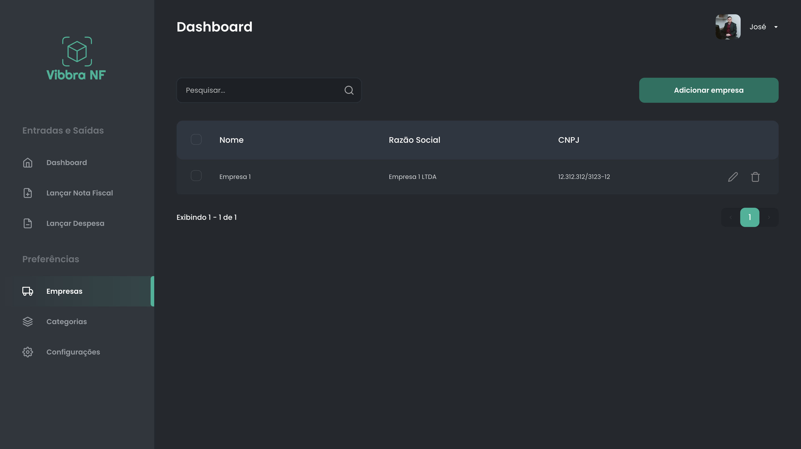
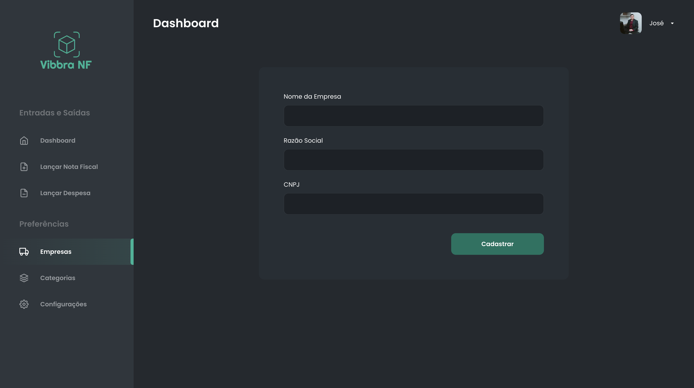
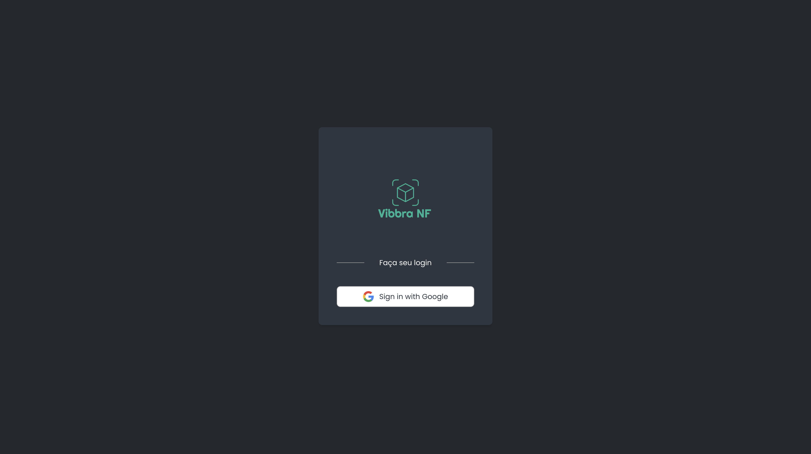

<p align="center">
Projeto desenvolvido em Next.js, que tem como objetivo ajudar microempreendedores a gerenciar suas Notas Fiscais.
</p>

<p align="center">
  <a href="https://opensource.org/licenses/MIT">
    
  </a>
</p>

<div>
  
  
  
  
</div>

<hr />

## Vibbra NF

Vibbra NF é um projeto que tem como objetivo ajudar os microempreendedores a organizar suas Receitas (geração de Notas Fiscais) para evitar surpresas com pagamento de impostos ao final do ano.

[Acesse o projeto](https://vibbra-challenge-beta.vercel.app/)

## Tecnologias usadas

- Next.js
- Tailwind
- TRPC
- Zod
- Prisma
- Next Auth
- React Query
- Inversify
- React Hook Form
- react-chartjs-2
- Jotai
- Headlessui

## Tarefas

O projeto teve estimativa inicial de 52 horas, descriminadas abaixo:

- [x] [Frontend] componentes de formulário [4 horas]
- [x] [Frontend] componentes de navegaçāo/listagem [4 horas]
- [x] [Frontend] página de login [1 hora]
- [x] [Frontend] páginas de gerenciamento categorias [2 horas]
- [x] [Frontend] páginas de gerenciamento empresas [2 horas]
- [x] [Frontend] páginas de gerenciamento notas fiscais [2 horas]
- [x] [Frontend] páginas de gerenciamento despesas [2 horas]
- [x] [Frontend] página de configuraçāo do usuário [2 horas]
- [x] [Frontend] página de dashboard com gráficos [3 horas]
- [x] [Frontend] Funcionalidade de login com google e gerenciamento de usuário logado [3 horas]
- [x] [Backend] Funcionalidade de cadastro/listagem/ediçāo/pesquisa/remoçāo de categoria [2 horas]
- [x] [Backend] Funcionalidade de cadastro/listagem/ediçāo/pesquisa/remoçāo de empresa [2 horas]
- [x] [Backend] Funcionalidade de cadastro/listagem/ediçāo/pesquisa/remoçāo de nota fiscal [2 horas]
- [x] [Backend] Funcionalidade de cadastro/listagem/ediçāo/pesquisa/remoçāo de despesa [2 horas]
- [x] [Backend] Funcionalidade de exibir o valor total por mês de notas fiscais geradas [1 hora]
- [x] [Backend] Funcionalidade de exibir o valor total por mês de despesas [1 hora]
- [x] [Backend] Funcionalidade de login com Google [3 horas]
- [x] [Backend] Permitir que os dados sejam acessados somente pelo usuário pertencentes [2 horas]
- [x] [Devops] Subir o projeto para produçāo [4 horas]
- [ ] [Testes] Testes automatizados [8 horas]

> Obs: nāo consegui fazer os testes e algumas melhorias finais de experiência de usuário por falta de tempo.

## Como rodar o projeto

- Clone o projeto
- Rode yarn na raiz
- Rode yarn dev para rodar o projeto local
- Para funcionar as seguintes variaveis de ambiente precisam ser preenchidas. Crie um arquivo .env e preencha de acordo com as indicações abaixo:

```
DATABASE_URL= // String do seu banco de dados
NEXTAUTH_SECRET= // Pode ser qualquer string, serve para o next auth gerar tokens de autenticaçāo
NEXTAUTH_URL=localhost:3000 // Endereço localhost
GOOGLE_CLIENT_ID= // Google Client ID que pode ser obtido no console da Google
GOOGLE_CLIENT_SECRET=  // Google Client Secret que pode ser obtido no console da Google
```

Ou se preferir pode acessar o [link](https://vibbra-challenge-beta.vercel.app/) para conferir o projeto em produçāo.

## Deploy

O deploy do site foi feito na vercel, e pode ser acesso pelo [link](https://vibbra-challenge-beta.vercel.app/).

## License

[LICENSE](https://opensource.org/licenses/MIT)

---

Feito com carinho por mim 👨🏻‍💻
